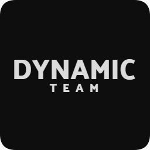

<h1 align="center">Dynamic Launcher</h1>

#### [
]() *Lanzador oficial de Dynamic Team*

#### *
Do you speak english 🇬🇧/🇺🇸 ? You can find the readme and the documentation translated into English [Here](/README_EN-US.md).
*

---

### **<ins>
Funciones del lanzador:
**

- ✅ Actualizaciones automáticas.

- 🔴 Launcher desactivado en mantenimiento.

- 🔒 Inicio de sesión a través de Microsoft.

- 🏴‍☠️ Uso solo mediante Dynamic Launcher.

- ⛏️ Soporte a todas las versiones de Minecraft.

- 📦 Soporta modloaders como Fabric y Forge.
 
- 📰 Apartado de noticias y actualizaciones in-app.

- ⚙️ Gestion de parámetros.

- 🟢 Estado del servidor.

    - Anuncia si está encendido o apagado.
    
    - Número de jugadores conecrados.

- ☕ Instalación automática de Java.

---

 
 

[
]() *Readme réalisé par [@Fefe_du_973](https://github.com/Fefedu973)*  

